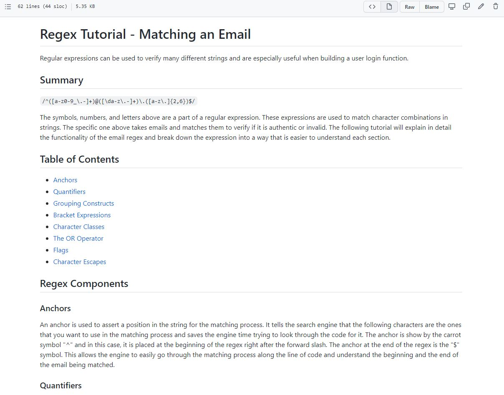

# Regex Tutorial - Email Match
---
## Description
Regex functions are an important tool to verify user information.  This repository includes a tutorial explaining different components of a Regular Expression as well as a breakdown of how the Email Match Regex functions.

<a href="https://github.com/courtbourt12/regex-tutorial/blob/main/gist-template.md#anchors">Click here to go to the deployed project</a>

 
 

 
 

## Table of Contents
    - Installation
    - Usage
    - License
    - Contributing
    - Tests
    - Questions

## Installation
Simply view the Regex Tutorial md file.

## Usage
This tutorial is for informational purposes only and is not a program.

## License
license used : MIT License

 

<a href="https://opensource.org/licenses/MIT">Click here for license info.</a>

## Contributing
Courtney Long

## Tests

N/A

 

--- 

 

## Questions

If you have any questions, feel free to contact me:
<ul>
<li> Github : <a href="https://github.com/courtbourt12">Click here to go to my GitHub page.</a> </li>
<li> Email : courtneylong877@gmail.com </li>
</ul>
